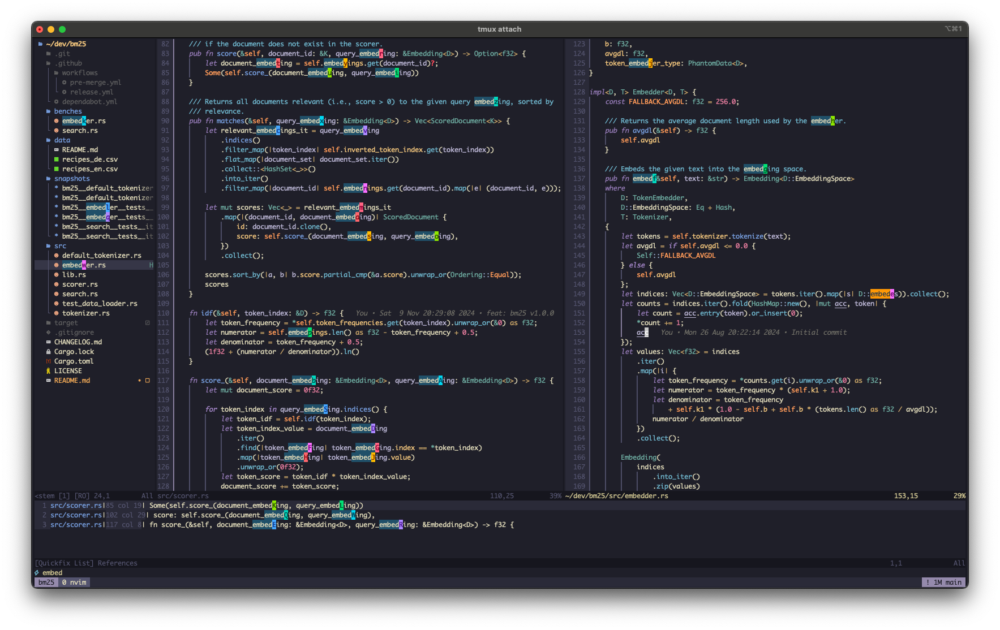

```
  ┏┓               
  ┃┃┏┓┏┓┏┓┓┏┏┓     
  ┣┛┗┻┣┛┗┻┗┫┗┻ Nvim
      ┃    ┛       
```

---

A fast, modern, modular, simple, and extensible Neovim configuration handcrafted by
[Michael-JB](https://github.com/Michael-JB).



> Note: This is my personal Neovim configuration. I may add/remove/change things at any
time, so I do not recommend tracking this repository. Instead, copy the parts that you like or 
fork it as a starting point for your own configuration.

## Features

- Lazy-loading of plugins via [lazy.nvim](https://github.com/folke/lazy.nvim)
- Interactive file explorer via [neo-tree.nvim](https://github.com/nvim-neo-tree/neo-tree.nvim) and
[nvim-window-picker](https://github.com/s1n7ax/nvim-window-picker)
- Auto-install of LSP servers via [mason.nvim](https://github.com/williamboman/mason.nvim),
[mason-lspconfig.nvim](https://github.com/williamboman/mason-lspconfig.nvim) and
[nvim-lspconfig](https://github.com/neovim/nvim-lspconfig)
- Syntax highlighting via [nvim-treesitter](https://github.com/nvim-treesitter/nvim-treesitter)
- Autocomplete via [nvim-cmp](https://github.com/hrsh7th/nvim-cmp)
- Auto-formatting via [conform.nvim](https://github.com/stevearc/conform.nvim) and
[mason-conform.nvim](https://github.com/zapling/mason-conform.nvim)
- Fuzzy-search everywhere via [telescope.nvim](https://github.com/nvim-telescope/telescope.nvim)
- Fast code navigation via [flash.nvim](https://github.com/folke/flash.nvim)
- Annotated keymaps via [which-key.nvim](https://github.com/folke/which-key.nvim)
- GitHub Copilot via [copilot.vim](https://github.com/github/copilot.vim) and
[CopilotChat.nvim](https://github.com/CopilotC-Nvim/CopilotChat.nvim)
- Inline git blame via [git-blame.nvim](https://github.com/f-person/git-blame.nvim)
- Seamless navigation to tmux via
[nvim-tmux-navigation](https://github.com/alexghergh/nvim-tmux-navigation)
- Light and dark themes via [kanagawa.nvim](https://github.com/rebelot/kanagawa.nvim)
- ...

## Prerequisites

> Note: I've only tested this configuration on Unix systems.

### Required
- [Git](https://git-scm.com/) >= 2.19.0
- [Neovim](https://neovim.io/) >= 0.10.0
- A C compiler toolchain for `tree-sitter`
([more info](https://github.com/nvim-treesitter/nvim-treesitter#requirements))
- Some things that you probably have already: `curl`, `tar`, `unzip`, `gzip`.

### Optional (but recommended)
- A terminal that supports true colour and undercurl, e.g., iTerm2 or WezTerm.
- A [Nerd Font](https://www.nerdfonts.com/) of your choice for icons
- [Ripgrep](https://github.com/BurntSushi/ripgrep) for searching with Telescope
- [Node.js](https://nodejs.org/) >= 12.12.0 for GitHub Copilot
- Language-specific package managers (e.g., `cargo` and `npm`) for LSP servers in these languages

## Install

1. Clone this repository to `~/.config/nvim`:
```sh
mkdir -p ~/.config
git clone git@github.com:Michael-JB/papaya-nvim.git ~/.config/nvim
```
2. Run `nvim`. It will automatically install the plugins.
3. Run `:checkhealth` to make sure everything is set up correctly.
4. Run `:Copilot setup` to set up GitHub Copilot.
